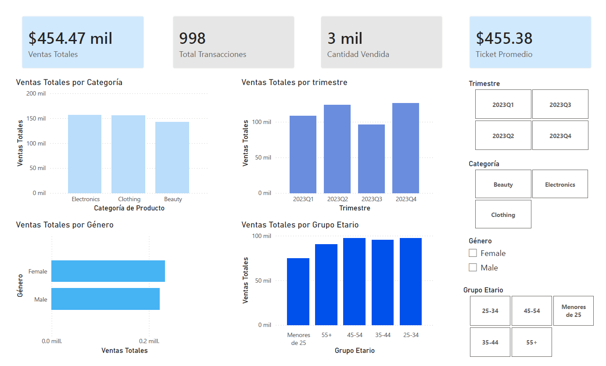

# 📊 Análisis de Ventas para Optimización de Stock

## 🎯 Objetivo
Analizar las ventas de un retail para identificar patrones por categoría, 
género, grupo etario y trimestre, y presentar insights mediante un dashboard 
interactivo en Power BI.

## 🛠️ Herramientas 
- Python (pandas, matplotlib)
- SQL
- Power BI
- GitHub

## 📂 Estructura del proyecto
- `data/`: Dataset limpio
- `sql/`: Consultas SQL
- `notebooks/`: Análisis exploratorio en Python
- `dashboard/`: Dashboard Power BI

## 📊 Dashboard Power BI

## 📈 Principales insights
- Las categorías Electronics y Clothing concentran la mayor parte de las ventas.
- El grupo etario 25–54 años es el principal generador de ingresos.
- Existe una clara estacionalidad trimestral, con pico en Q4.

## 🚀 Próximos pasos
- Análisis de ticket promedio por segmento
- Comparación interanual

## 📎 Autor
Silvio Guillén
